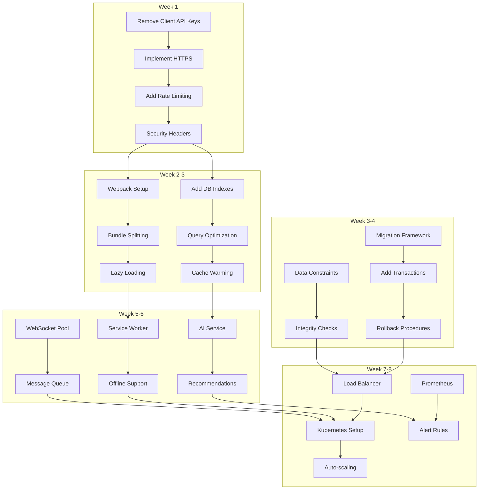

# Finding Sports - Visual Implementation Roadmap

## 📊 8-Week Implementation Timeline

```
Week 1  Week 2  Week 3  Week 4  Week 5  Week 6  Week 7  Week 8
━━━━━━━━━━━━━━━━━━━━━━━━━━━━━━━━━━━━━━━━━━━━━━━━━━━━━━━━━━━━━━━━━━━━━━━━━━━━━━━━
🔒 SECURITY FIXES
└──────┘
        🚀 PERFORMANCE OPTIMIZATION  
        └──────────────────────┘
                📊 DATABASE INTEGRITY
                └──────────────────────┘
                                🎨 ENHANCED FEATURES
                                └──────────────────────┘
                                                📈 SCALABILITY
                                                └──────────────────────┘
```

## 🎯 Impact vs Effort Matrix

```
High Impact ┃ 🔒 Security Fixes    │ 🚀 Performance Opt
           ┃ (Week 1)             │ (Week 2-3)
           ┃ • API Key Protection │ • Bundle Optimization
           ┃ • HTTPS Redirect     │ • Query Optimization
           ┃ • Rate Limiting      │ • Intelligent Caching
           ┃──────────────────────┼────────────────────────
           ┃ 📊 Database Integrity│ 🎨 Features & 📈 Scale
           ┃ (Week 3-4)          │ (Week 5-8)
           ┃ • Migration Safety   │ • PWA Implementation
           ┃ • Constraints        │ • AI Discovery
Low Impact ┃ • Rollback Support   │ • Monitoring Setup
           ┗━━━━━━━━━━━━━━━━━━━━━┷━━━━━━━━━━━━━━━━━━━━━━━━
             Low Effort              High Effort
```

## 🔗 Critical Dependencies Flow



## 📋 Phase-by-Phase Checklist

### ✅ Phase 1: Security (Week 1)
- [ ] Move Google Maps API key to server environment
- [ ] Implement HTTPS redirect middleware
- [ ] Add rate limiting (auth: 5/15min, API: 60/min)
- [ ] Configure CSP headers
- [ ] Enable HSTS with preload
- [ ] Add request sanitization
- [ ] Implement CSRF protection
- [ ] Security audit completion

### ✅ Phase 2: Performance (Week 2-3)
- [ ] Set up Webpack build process
- [ ] Implement code splitting (core/features/vendor)
- [ ] Add progressive loading
- [ ] Create spatial indexes for location queries
- [ ] Optimize find_nearby_games function
- [ ] Implement query result caching
- [ ] Add connection pooling
- [ ] Performance testing & benchmarks

### ✅ Phase 3: Database (Week 3-4)
- [ ] Create schema_versions table
- [ ] Wrap all migrations in transactions
- [ ] Add rollback procedures
- [ ] Implement date validation constraints
- [ ] Add attendee limit constraints
- [ ] Create unique indexes for data integrity
- [ ] Add foreign key constraints
- [ ] Migration testing framework

### ✅ Phase 4: Features (Week 5-6)
- [ ] Create service worker
- [ ] Implement offline pages
- [ ] Add PWA manifest
- [ ] WebSocket connection pooling
- [ ] Message queue for offline users
- [ ] Heartbeat mechanism
- [ ] AI recommendation engine
- [ ] Advanced search filters

### ✅ Phase 5: Scalability (Week 7-8)
- [ ] Configure nginx load balancer
- [ ] Set up Kubernetes cluster
- [ ] Deploy backend pods
- [ ] Configure HPA rules
- [ ] Install Prometheus
- [ ] Create Grafana dashboards
- [ ] Set up alert rules
- [ ] Load testing & optimization

## 🚦 Go/No-Go Criteria

### Phase 1 → Phase 2
✅ All API keys removed from client code
✅ HTTPS enforced in production
✅ Rate limiting active and tested
✅ Security scan shows no critical issues

### Phase 2 → Phase 3
✅ Bundle size reduced by >40%
✅ Page load time <2s on 3G
✅ Database queries <100ms p95
✅ Memory usage stable under load

### Phase 3 → Phase 4
✅ All migrations have rollback tested
✅ Zero data integrity violations
✅ Backup and restore procedures verified
✅ Migration CI/CD pipeline active

### Phase 4 → Phase 5
✅ PWA score >90
✅ Offline mode functional
✅ WebSocket latency <100ms
✅ AI recommendations >80% relevant

### Phase 5 → Production
✅ 99.9% uptime achieved in staging
✅ Auto-scaling tested up to 20 pods
✅ All alerts configured and tested
✅ Runbooks completed for all scenarios

## 📊 Resource Allocation

```
Team Distribution:
━━━━━━━━━━━━━━━━━━━━━━━━━━━━━━━━━━━━━━━━━━━━━━━━━━━━━━━━━
Security    ████████░░░░░░░░░░░░░░░░░░░░░░░░ 20% (2 devs)
Performance ████████████████░░░░░░░░░░░░░░░░ 40% (3 devs)
Database    ████████░░░░░░░░░░░░░░░░░░░░░░░░ 20% (2 devs + 1 DBA)
Features    ████████████░░░░░░░░░░░░░░░░░░░░ 30% (4 devs)
DevOps      ████████░░░░░░░░░░░░░░░░░░░░░░░░ 20% (2 engineers)
```

## 🎯 Success Metrics Dashboard

### Week 1 Target
- 🔒 Security Score: A+
- ⚡ API Response: <300ms
- 🛡️ Failed Auth: <5/15min
- ✅ HTTPS Traffic: 100%

### Week 3 Target
- 📦 Bundle Size: -50%
- ⚡ Page Load: <2s
- 🗄️ Query Time: <100ms
- 💾 Cache Hit: >80%

### Week 5 Target
- 📱 PWA Score: >90
- 🔌 WebSocket Latency: <100ms
- 🤖 AI Accuracy: >80%
- 😊 User Satisfaction: >4.5/5

### Week 8 Target
- 📈 Uptime: 99.9%
- ⚡ P95 Response: <200ms
- 🚀 Scale Capacity: 10x
- 📊 Test Coverage: >80%

## 🚨 Risk Indicators

### 🔴 Red Flags (Stop & Review)
- Security vulnerability discovered
- Data loss during migration
- Performance regression >20%
- User complaints spike >50%

### 🟡 Yellow Flags (Proceed with Caution)
- Timeline slippage >1 week
- Resource availability <80%
- Test failures >10%
- Memory usage growth >expected

### 🟢 Green Flags (Full Speed Ahead)
- All tests passing
- Metrics within targets
- Team confidence high
- User feedback positive

## 📞 Escalation Matrix

| Issue Type | Primary Contact | Escalation | Timeline |
|------------|----------------|------------|----------|
| Security | Security Lead | CTO | <1 hour |
| Data Loss | DBA | VP Engineering | Immediate |
| Performance | Tech Lead | Engineering Manager | <4 hours |
| Deployment | DevOps Lead | Platform Team | <2 hours |
| User Impact | Product Manager | VP Product | <30 mins |

## 🎉 Celebration Milestones

- **Week 1 Complete**: Team lunch - Security fortress built! 🏰
- **Week 3 Complete**: Happy hour - Performance blazing fast! 🚀
- **Week 5 Complete**: Team dinner - Features ship! 🎨
- **Week 8 Complete**: Launch party - Mission accomplished! 🎊

---

*This roadmap is a living document. Update progress daily and review in team standups.*