# Data Flow Diagrams - Sports Scraping System

## Overview

This document provides detailed data flow diagrams showing how data moves through the sports scraping system, from source discovery to real-time user updates.

## 1. High-Level Data Flow

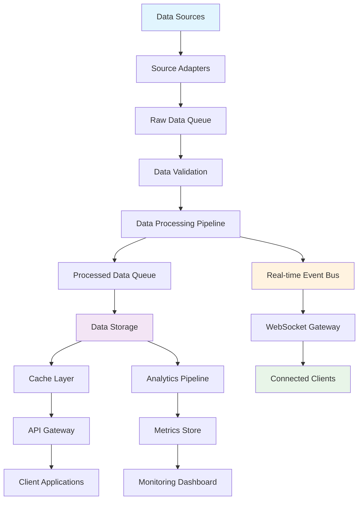

## 2. Detailed Source Processing Flow

### 2.1 Source Discovery and Scheduling

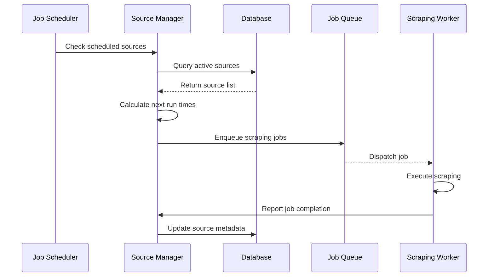

### 2.2 Data Scraping Process

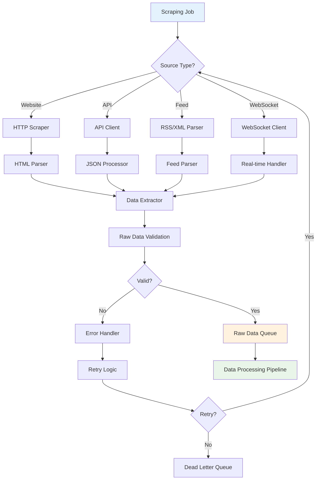

## 3. Data Processing Pipeline

### 3.1 Processing Stages

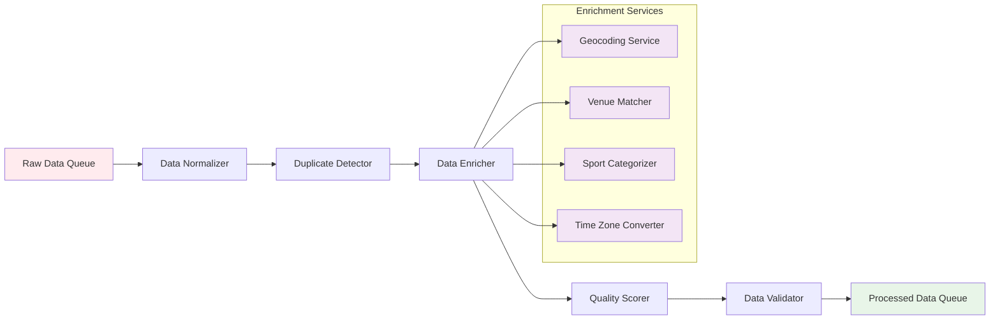

### 3.2 Data Normalization Process

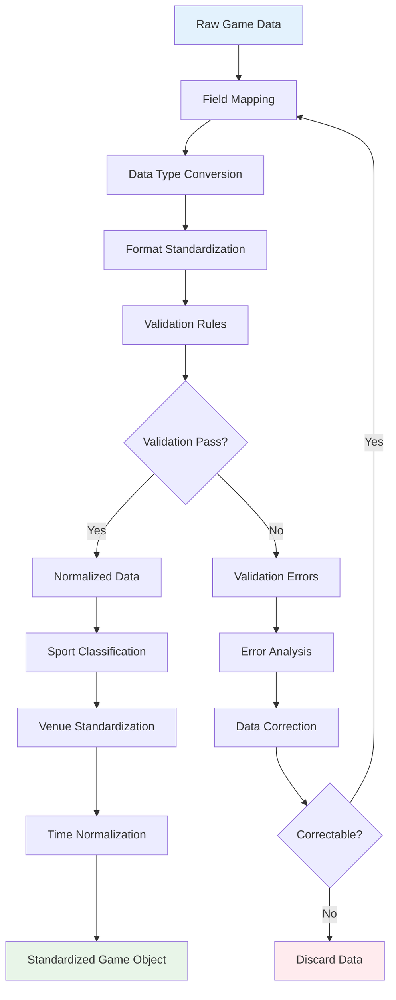

## 4. Real-time Data Streaming

### 4.1 Event-Driven Architecture

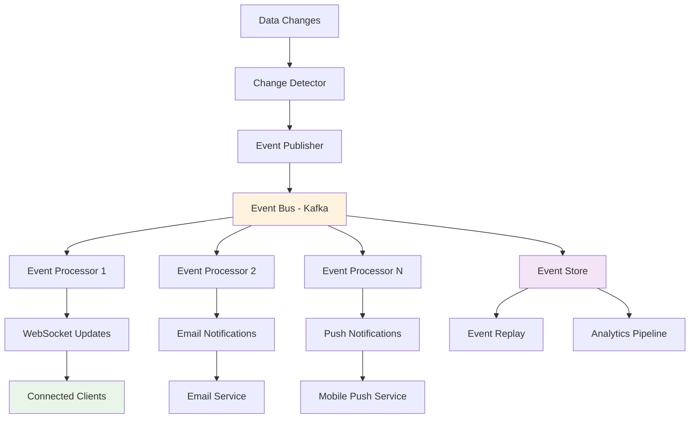

### 4.2 WebSocket Connection Management

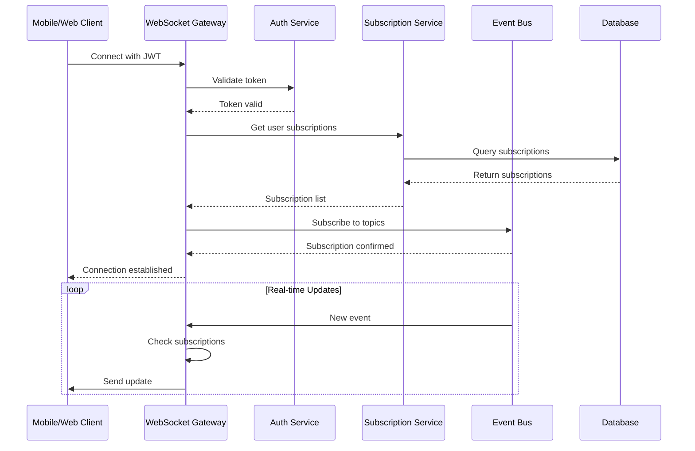

## 5. Data Storage Flow

### 5.1 Multi-layered Storage Strategy

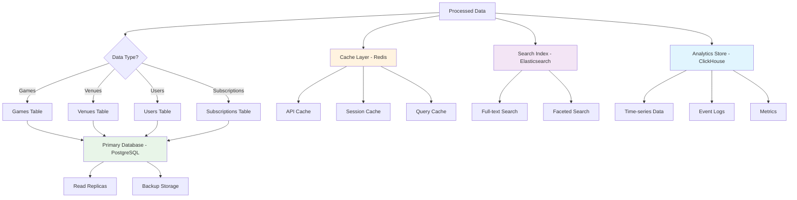

### 5.2 Cache Invalidation Strategy

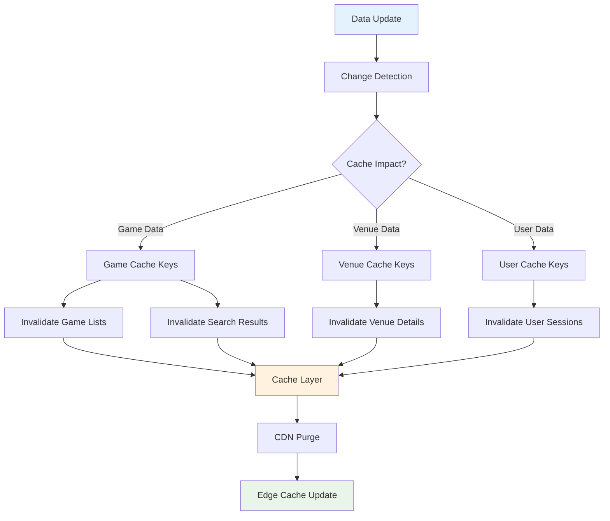

## 6. API Data Flow

### 6.1 Request Processing Pipeline

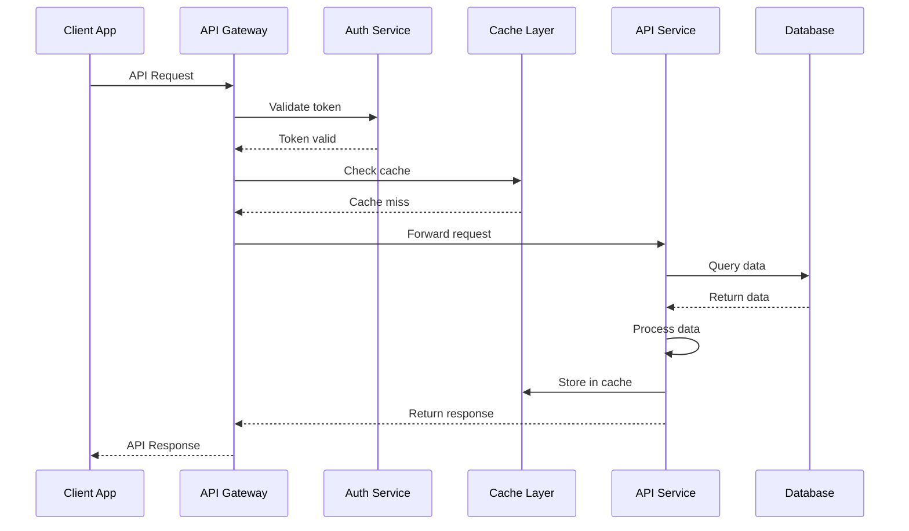

### 6.2 Search Flow

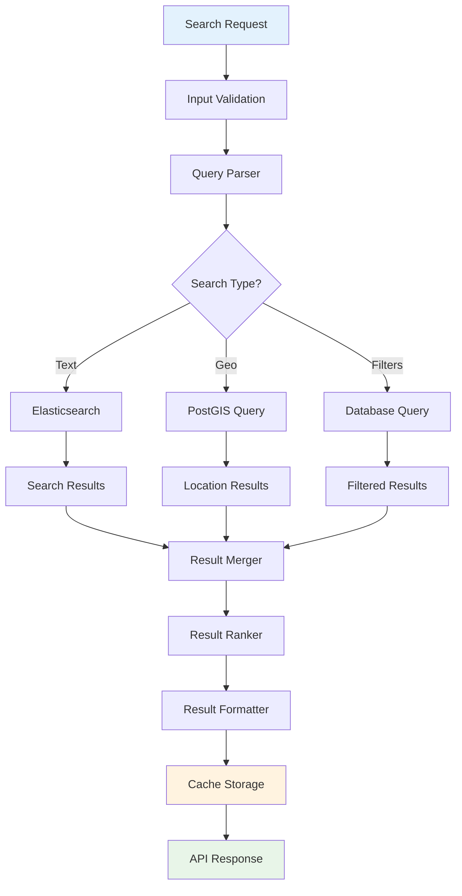

## 7. Monitoring Data Flow

### 7.1 Metrics Collection

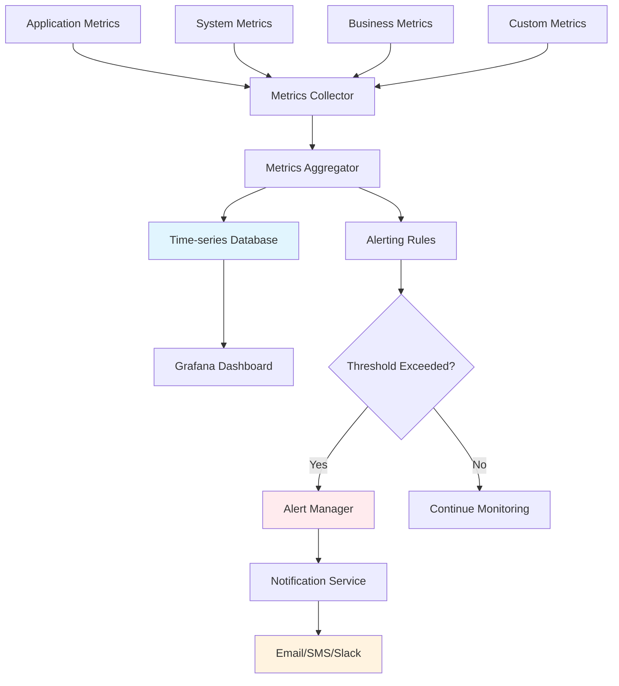

### 7.2 Log Processing Flow

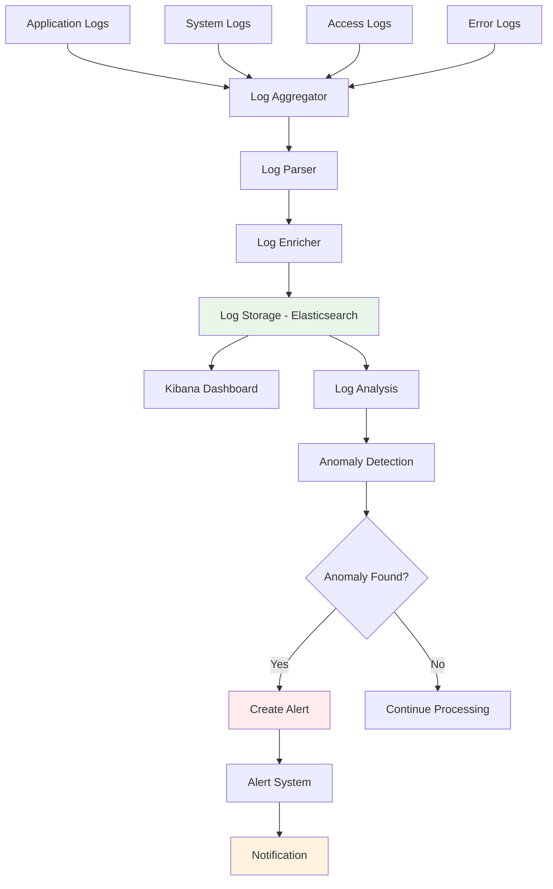

## 8. Error Handling Flow

### 8.1 Error Processing Pipeline

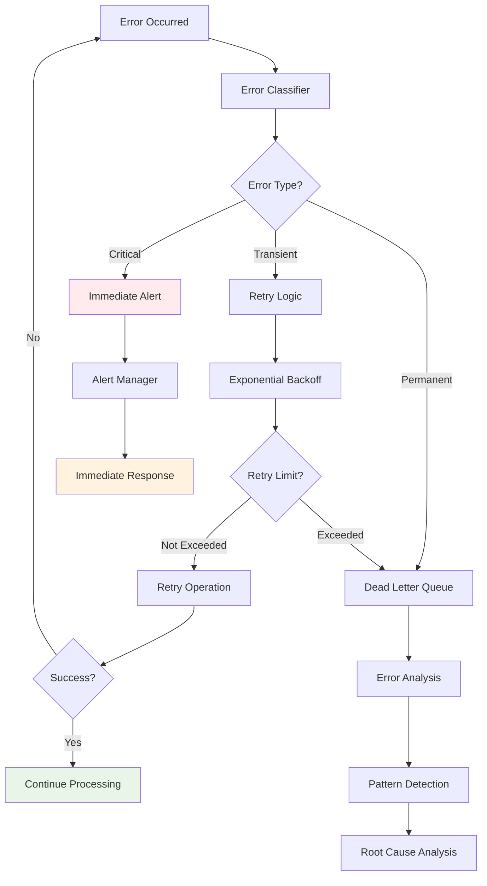

### 8.2 Circuit Breaker Pattern

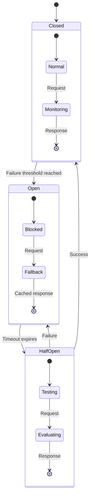

## 9. Backup and Recovery Flow

### 9.1 Data Backup Strategy

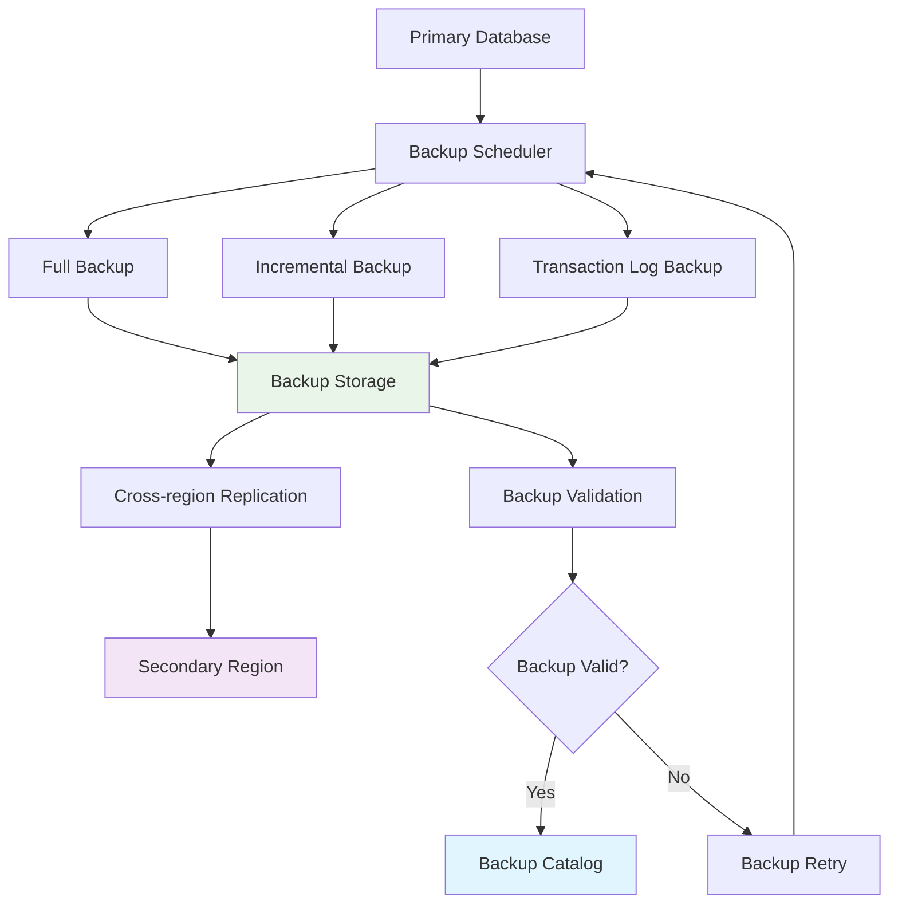

### 9.2 Disaster Recovery Process

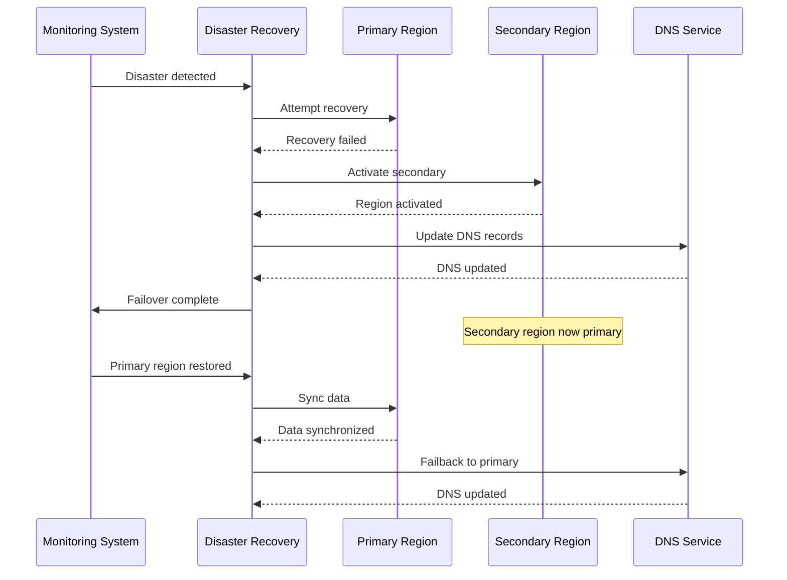

This comprehensive data flow documentation provides the detailed understanding needed to implement and maintain the sports scraping system's data processing capabilities.